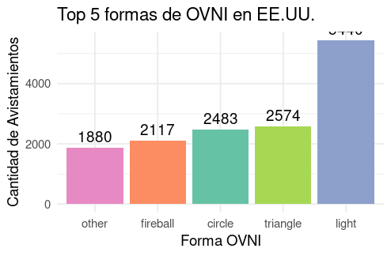
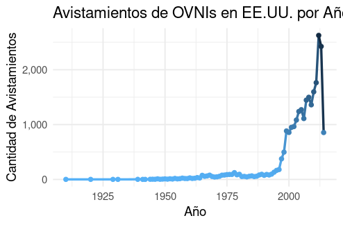
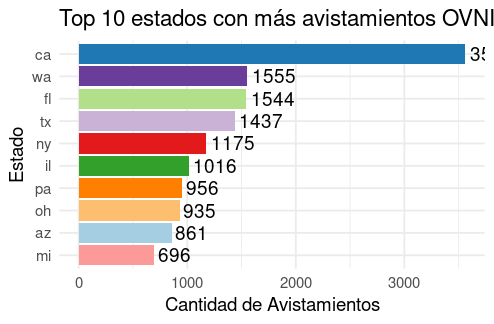
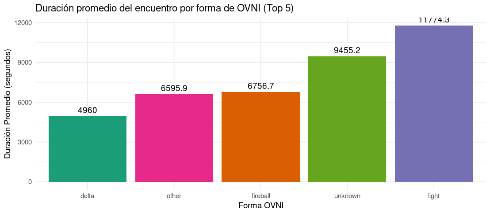

# 🌌 Avistamientos de OVNIs en Estados Unidos

Este proyecto presenta una visualización exploratoria basada en reportes de avistamientos de objetos voladores no identificados (OVNIs) registrados en Estados Unidos. Se trata de un análisis de datos orientado a descubrir patrones, frecuencias y comportamientos comunes entre los miles de reportes recopilados a lo largo de los años.

---

## 🛰️ Introducción

Los OVNIs han capturado la imaginación de millones de personas en todo el mundo. A lo largo de los años, se han reportado miles de avistamientos, muchos de ellos en Estados Unidos, donde existe una larga tradición de investigación y documentación de fenómenos aéreos anómalos.

Este proyecto tiene como objetivo examinar estos datos de forma objetiva mediante herramientas estadísticas y visuales que permitan responder preguntas como:

- ¿Cuáles son las formas más comunes de OVNI reportadas?
- ¿En qué años se produjeron más avistamientos?
- ¿Qué estados reportan más fenómenos?
- ¿Hay alguna relación entre la forma del OVNI y la duración del avistamiento?

---

## 📊 Visualizaciones incluidas

La página web incluye los siguientes gráficos generados con **R** a partir de un dataset real:

### 1. 🛸 Top 5 Formas de OVNI Reportadas

> Las formas más comunes incluyen esferas, luces, discos y triángulos.

---

### 2. 📅 Avistamientos por Año

> El número de avistamientos creció significativamente desde los años 90, alcanzando picos entre 2008 y 2014.

---

### 3. 🗺️ Top 10 Estados con Más Avistamientos

> California, Florida, y Washington son los estados que más reportes concentran.

---

### 4. ⏱️ Duración Promedio por Forma de OVNI

> Las formas como "changing" o "cylinder" presentan encuentros significativamente más prolongados.

---

## 🛠️ Herramientas utilizadas

| Herramienta    | Propósito                               |
|----------------|------------------------------------------|
| `readxl`       | Lectura de archivos Excel                |
| `dplyr`        | Manipulación y filtrado de datos         |
| `ggplot2`      | Generación de visualizaciones            |
| `lubridate`    | Manejo de fechas                         |
| `scales`       | Formato de ejes y escalas en los gráficos |
| `RStudio`      | Entorno de desarrollo en R               |
| `HTML + CSS`   | Creación del sitio web estático          |

---
 **Fuente:** [UFO Sightings Dataset - Kaggle](https://www.kaggle.com/datasets/NUFORC/ufo-sightings)
- **Cobertura:** Avistamientos entre 1906 y 2014 (EE.UU.)
- **Variables:** Fecha, lugar, duración, forma del objeto, país, etc.

---

## 👨‍💻 Autor

Proyecto realizado por **[Amada Morales y Vicente Muñoz]** como parte de una actividad académica de análisis y visualización de datos.

---

> _"La verdad está ahí afuera... pero los datos están aquí."_
